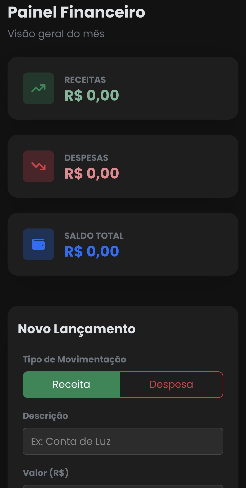
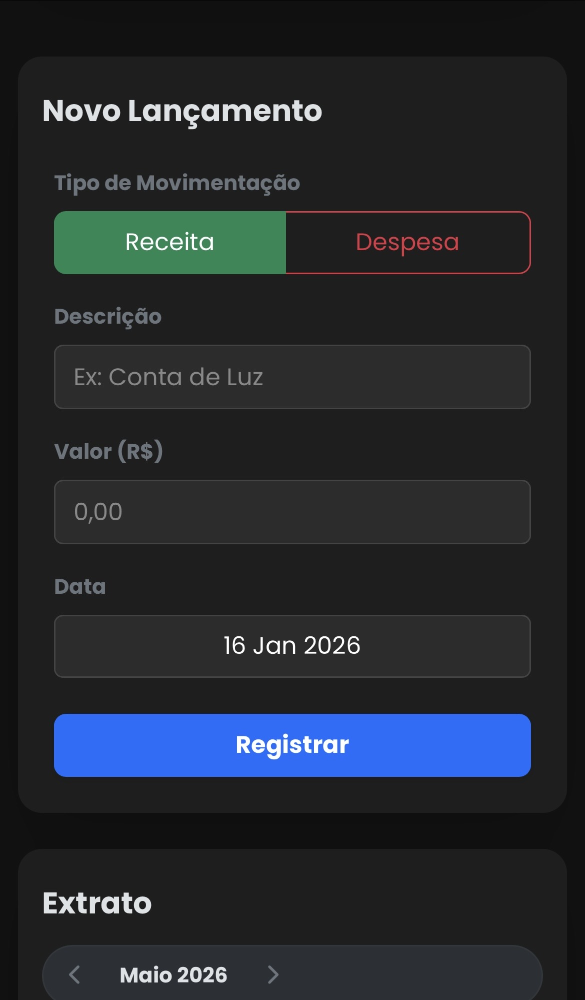
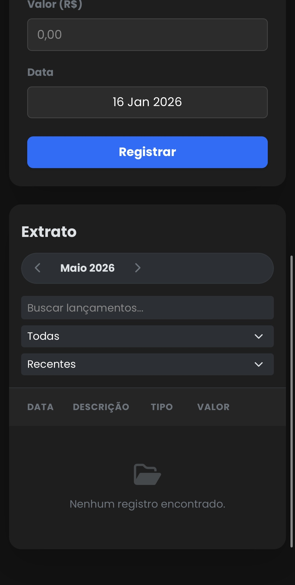

# 💰 Dashboard de Controle Financeiro

>  Aplicação web de organização financeira para ajudar minha mãe com as suas finanças :) 

---
## 🚀 Sobre o Projeto

Este projeto nasceu da necessidade de criar uma ferramenta simples, eficiente e acessível para controle financeiro familiar (especificamente minha mãe). O objetivo foi tirar ela do caderninho e criar uma aplicação web que pudesse ser acessada diretamente pelo celular, principalmente, ou pelo computador

Além de resolver um problema real, este projeto serviu como laboratório para aplicar conceitos de **Desenvolvimento Full Stack**, integrando uma interface responsiva com uma API RESTful.

Este projeto também serviu para que eu pudesse aprender ainda mais sobre prompts e IA, pois foi com o auxílio do Gemini Pro 3.0 que eu construí todo o front-end para que eu pudesse conseguir desenvolver e exercitar os meus conhecimentos com back-end.

---

## ✨ Funcionalidades

- 🌑 **Interface Dark Mode:** Design moderno e confortável visualmente, utilizando Bootstrap 5.
- 💵 **Gestão de Transações:** Adicionar receitas e despesas com descrição, valor e data.
- 🗑️ **CRUD (quase rs) Completo:** Listagem, Criação e Exclusão (com confirmação de segurança) de lançamentos.
- 📊 **Resumo Financeiro:** Cards de KPI que mostram o total de Entradas, Saídas e o Saldo atual em tempo real.
- 📅 **Navegação Mensal:** Botões para transitar entre os meses e visualizar o histórico passado ou futuro.
- 🔍 **Filtros e Ordenação:**
  - Busca por texto (descrição).
  - Filtro por tipo (Receita/Despesa).
  - Ordenação por Data ou Valor.
- 📱 **100% Responsivo:** Layout adaptável para desktops e smartphones.

---

## 🛠️ Tecnologias Utilizadas

### Front-end
- **HTML5 & CSS3**
- **JavaScript (Vanilla ES6+)**
- **Bootstrap 5.3**
- **FontAwesome**
- **Google Fonts (Poppins)**

### Back-end
- **Java 21**
- **Spring Boot 3**: Criação da API REST.
- **Spring Data JPA**: Persistência de dados e abstração de SQL.
- **MySQL**: Banco de dados relacional.
- **Maven**: Gerenciamento de dependências e build.

---

## 📸 Screenshots

---
Se você gostou desse projeto, sinta-se à vontade para dar uma ⭐️ no repositório!